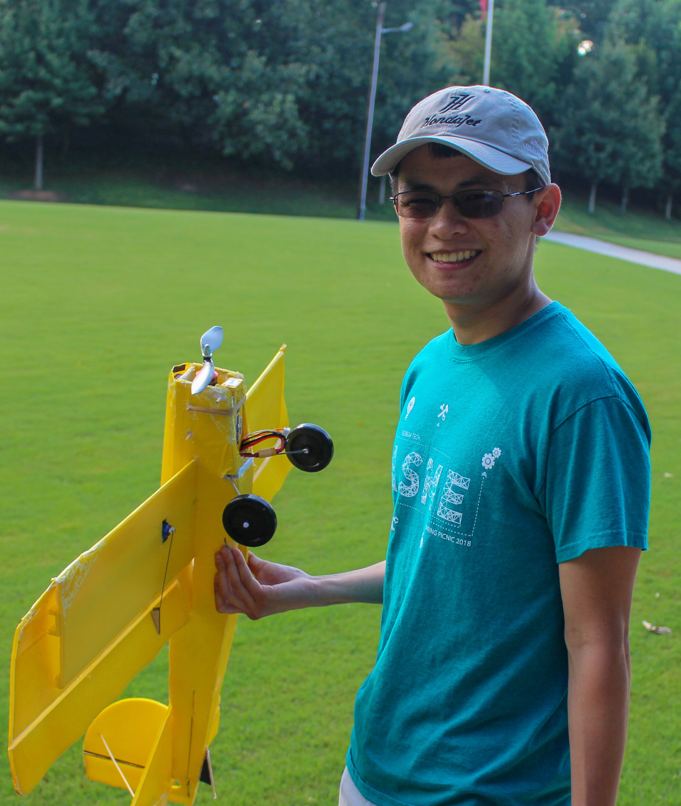

---
# Feel free to add content and custom Front Matter to this file.
# To modify the layout, see https://jekyllrb.com/docs/themes/#overriding-theme-defaults

layout: home
---
<!-- 
 -->
  

    

      
I'm Miles, an undergraduate mechanical engineering student at Georgia Tech and aspiring researcher in biomechanics and aerodynamics.

    

    

      
    

  

<!-- 
 -->

<!-- 

Time is just a construct, and this website is currently in work. It'll be done when it's done.

*
flying fixed wing is a simple pleasure
* -->
